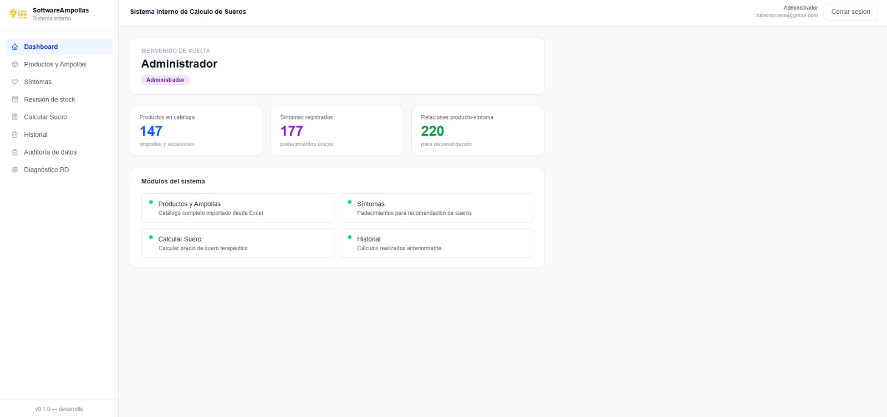
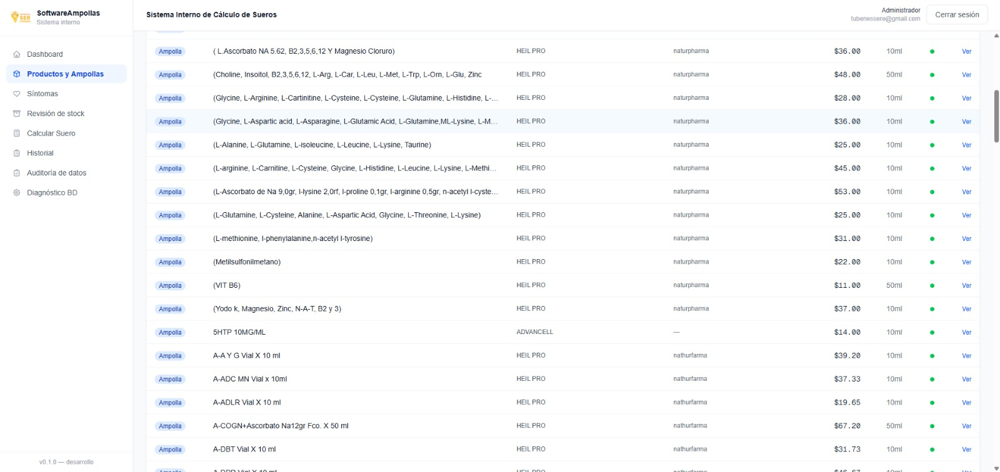
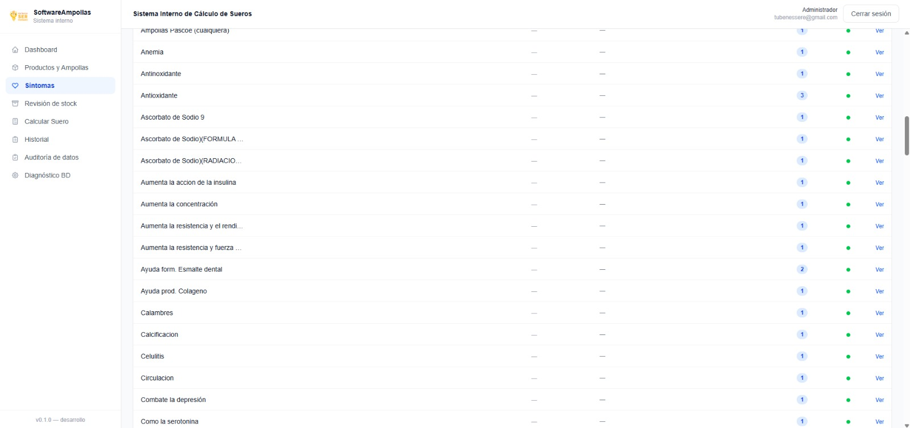
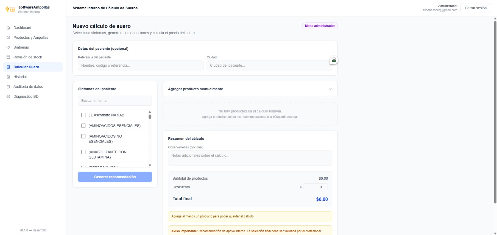
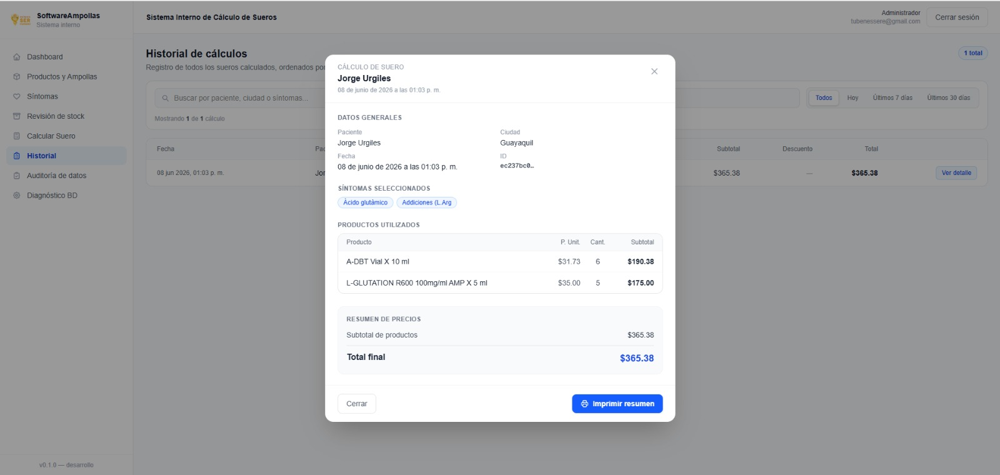

# SoftwareAmpollas v0.1.0

Sistema interno de cálculo y gestión de sueros vitamínicos. Permite administrar productos, síntomas y recomendaciones, calcular presupuestos de tratamientos, y llevar historial y auditoría de datos.

---

## 🖥️ Capturas del sistema

### 🖥️ Capturas del sistema


### 📊 Dashboard


### 💊 Productos


### 🧠 Síntomas


### 🧮 Cálculo de suero


### 📜 Historial


---

## Stack

| Capa | Tecnología |
|---|---|
| Framework | Next.js 16 (App Router, Turbopack) |
| Lenguaje | TypeScript |
| Estilos | Tailwind CSS |
| Base de datos | Supabase (PostgreSQL) |
| Autenticación | Supabase Auth |
| PDF | PDFKit (API Route servidor) |
| Deploy objetivo | Netlify |

---

## Módulos disponibles

| Módulo | Ruta | Descripción |
|---|---|---|
| Login | `/login` | Autenticación con Supabase Auth. Redirección automática según sesión. |
| Dashboard | `/dashboard` | Pantalla de bienvenida tras iniciar sesión. |
| Productos | `/products` | Catálogo de ampollas e insumos. Filtros, detalle, crear y editar (admin). |
| Síntomas | `/symptoms` | Catálogo de padecimientos. Crear, editar y vincular productos con nivel de recomendación (admin). |
| Calcular Suero | `/calculations` | Arma un presupuesto seleccionando síntomas y productos. Calcula totales automáticamente. |
| Historial | `/history` | Listado de cálculos anteriores con filtros y modal de detalle. |
| Auditoría de datos | `/data-audit` | Tabla de auditoría general. Exportación a PDF. |
| Revisión de stock | `/stock-review` | Vista de lectura del stock actual. Sin modificación de datos por ahora. |
| Diagnóstico BD | `/test-supabase` | Verifica conexión a Supabase, variables de entorno y datos de tablas principales. Solo para desarrollo. |

---

## Variables de entorno

Crear un archivo `.env.local` en la raíz del proyecto con las siguientes variables. **No subir este archivo al repositorio.**

```
NEXT_PUBLIC_SUPABASE_URL=https://<tu-proyecto>.supabase.co
NEXT_PUBLIC_SUPABASE_ANON_KEY=<clave-anon-publica>
SUPABASE_SERVICE_ROLE_KEY=<clave-service-role-solo-servidor>
```

> `SUPABASE_SERVICE_ROLE_KEY` es exclusiva del servidor. Nunca debe exponerse en el cliente ni en el repositorio.

---

## Comandos

```bash
# Servidor de desarrollo
npm.cmd run dev

# Build de producción
npm.cmd run build
```

---

## Advertencias

- **No subir `.env.local`** al repositorio. El `.gitignore` lo excluye via `.env*`.
- **No ejecutar `stock-schema.sql`** todavía. El esquema de inventario formal no está implementado.
- **Revisión de stock es solo lectura** en esta versión. No permite modificar cantidades ni registrar movimientos.
- **`middleware.ts` está deprecado en Next.js 16.** La convención fue renombrada a `proxy`. El middleware sigue funcionando en la versión actual, pero deberá migrarse antes de actualizar Next.js.

---

## Pendientes futuros

- [ ] Módulo de inventario formal (entradas, salidas, ajustes de stock)
- [ ] Deploy a Netlify
- [ ] Renombrar `src/middleware.ts` → `src/proxy.ts` al migrar Next.js
- [ ] Agregar `export const dynamic = 'force-dynamic'` a `/test-supabase` si se usa en producción

---

## Estado actual

| Verificación | Estado |
|---|---|
| TypeScript | Sin errores |
| `npm run build` | Aprobado |
| Prueba manual completa | Aprobada |
| Secrets en cliente | Ninguno |
| `.gitignore` | Correcto |
